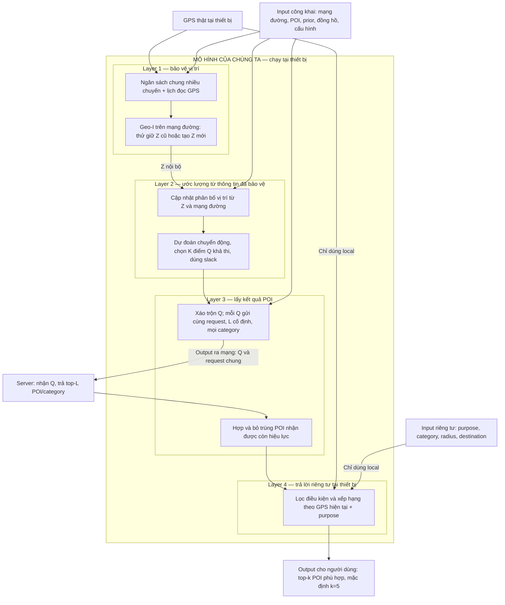

# Hoàn thiện phương pháp, giữ nguyên nền tảng Geo-I

**Geo-I tiếp tục là cơ chế bảo vệ vị trí của mô hình.** Vòng này hoàn thiện cách quản lý nhiều chuyến, cách gửi Q và cách trả lời POI tại thiết bị. Không đổi REM, phép thử có nhiễu, quy tắc tái sử dụng Z hay phép ước lượng vị trí đã bảo vệ. Mã của các thành phần đó được giữ nguyên và kiểm tra hash.

Đây là phần tiếp theo của [cập nhật sau buổi gặp 03/10](2026-10-05_supervisor_followup.md). Kết quả cũ và dữ liệu cũ được giữ lại. Các phép thử dưới đây có giao thức khác nhau, nên không ghép chúng thành một bảng xếp hạng chung.

## Luồng của mô hình

**Z là điểm tham chiếu nội bộ; Q là các tọa độ gửi tới server; P là kết quả POI cho người dùng.** Q được chọn từ phân bố vị trí đã bảo vệ và mạng đường, không phải cứ lấy năm điểm trong một vòng tròn quanh GPS thật. Khi hết ngân sách, layer 2 vẫn dự đoán từ thông tin đã bảo vệ; layer 1 không đọc thêm GPS để tạo Q. GPS dùng tại layer 4 không tác động trở lại Q hoặc lịch gửi.

| Thành phần | Vì sao cần | Scenario liên quan và phạm vi |
|---|---|---|
| Geo-I + thử tái sử dụng có nhiễu | Hạn chế thông tin vị trí mỗi lần đọc; tránh lộ bằng một quyết định giữ/đổi Z chính xác | S1–S3; là nền tảng của S9/S10 |
| Ước lượng, chuyển động trên mạng đường, slack | Tìm Q có thể di chuyển và phủ POI tốt hơn mà không hỏi GPS thêm | Giữ utility; không tự tạo thêm bảo đảm privacy |
| Ngân sách chung cho các chuyến liên kết | Không cấp lại toàn bộ ngân sách sau mỗi chuyến | Hỗ trợ S4 và lịch sử S5/S6; không che account, IP hoặc danh tính |
| Nhiễu mạnh hơn trên mọi lần đọc | Online không biết trước lần nào là GPS cuối; không cần delay hay GPS tương lai | S9/S10, trong phạm vi tọa độ |
| Request chung + lọc purpose tại thiết bị | Purpose, bán kính và đích không đi vào request | S7: che nội dung tường minh; tuyến đường/thời gian vẫn có thể tiết lộ nhu cầu |
| Đổi thứ tự Q mỗi lần gửi | Bỏ nhãn slot cố định của đường giả | Giảm một kênh giao thức; không ngăn ghép đường bằng hình học |

## 1. Ngân sách qua nhiều chuyến: sửa một điều kiện quan trọng

Giới hạn `0,0575/m` của GeoI-Endpoint20 trước đây là **mỗi phiên**. Nếu sáu phiên cùng người/xe được liên kết, giới hạn cộng tối đa thành `0,345/m`. Module [session_budget.py](../../core/session_budget.py) giữ một sổ ngân sách cục bộ cho cả thời hạn cố định, cấp phần ngân sách trước khi đọc GPS và không hoàn lại theo đường đi riêng tư.

Với tổng giới hạn hiệu dụng `C`, `N` phiên và horizon `H` công khai:

\[
u=\frac{C}{N(2H-1)},\qquad B_{\text{phiên}}=2Hu,
\qquad C_{\text{phiên}}=C/N.
\]

`u` là ε cho cả phép thử và tạo Z. Chọn N/H trước; không dùng đường đi thật để chọn chính sách có lợi hơn. Factory phải tính emission của belief đúng với `u`. Chuyến thứ N+1 không lấy GPS và không gửi request; tắt/mở client không cấp lại phần đã giữ. Sang thời hạn mới, ngân sách vẫn cộng khi tuyên bố bảo vệ một lịch sử dài hơn.

Điều kiện triển khai là mọi app/thiết bị liên kết trong tuyên bố dùng **cùng sổ và khóa riêng tư còn nguyên trạng**; xóa/rollback hoặc chia sổ riêng phá điều kiện này. Lịch bật/tắt và tick công khai do ứng dụng gọi tuân thủ; wrapper không tự che thời gian hoạt động.

Trong nghiên cứu S4, **GeoI-Epoch6-H8** có `N=6,H=8,C=0,23/m,u≈0,002556/m`. **GeoI-Epoch6-H12** có cùng C/N, nhưng `u≈0,001667/m` và nhiều lượt đọc hơn. Tên này phân biệt số phiên với H; chúng là cấu hình của cùng thuật toán Geo-I.

| S4, cùng cohort development | Cap /6 phiên | AUC liên kết người / xe ↓ | Recall@5 ↑ |
|---|---:|---:|---:|
| GPS thật | — | 0,773 / 0,716 | 100% |
| Reset từng phiên, H12 | 0,345 | 0,632 / 0,544 | 97,03% |
| GeoI-Epoch6-H12 | 0,23 | 0,640 / 0,577 | 95,53% |
| **GeoI-Epoch6-H8** | **0,23** | **0,526 / 0,504** | **97,23%** |

H8 đáng kiểm tra tiếp, nhưng chỉ ba family test đã được xem trước trong quá trình phát triển. Family còn rò có AUC tới `0,694/0,681`; phần chuyến dài trên train có Recall `87,51%`. H12 có cap nhỏ hơn reset nhưng AUC chưa tốt hơn. Sổ ngân sách không tự khiến attacker yếu đi: đối chứng có cùng tổng cap với reset cho đầu ra giống hệt ở cả 144 phiên.

[Giải thích đầy đủ, giao thức và evidence](2026-10-05_session_budget.md).

## 2. Nhiều purpose: giữ utility mà không gửi nhu cầu thật

Client hỗ trợ bốn cách chọn POI: gần nhất theo quãng đường, nhanh nhất theo thời gian di chuyển, trong bán kính, và ít đi vòng tới một đích riêng tư. Tất cả lấy từ cùng kết quả server; đổi purpose không tạo request mới. Các điều kiện như bán kính được lọc thật sự, thay vì trả POI không phù hợp rồi chỉ đo Recall.

Đã thử chín cấu hình: mục tiêu phủ POI cũ hoặc trộn với trọng số công khai của nhiều purpose, kết hợp `L=10/20/40`. **Giữ cấu hình gốc α=0,L20.** Trọng số mới có cải thiện Recall nhưng một số cấu hình làm MAE attacker nhỏ hơn trên tập chọn; L40 không qua giới hạn byte. Không dùng điểm test để đổi quyết định này.

Test development của cấu hình giữ lại: Recall trung bình bốn purpose **94,33%**; gần nhất/nhanh nhất **96,33%**, bán kính **90,10%**, đi vòng **94,57%**; không trả POI vi phạm. Mạng tái dựng ở phép thử này dùng tốc độ 8 m/s đồng nhất nên hai purpose đầu có thứ hạng giống nhau; unit test riêng có tốc độ khác nhau xác nhận hai hàm có thể cho kết quả khác. Các số này chưa chứng minh performance trong giao thông thực tế.

Z và lịch thử/đọc GPS được giữ giống hệt giữa các mục tiêu/depth cùng chuyến và RNG; Q có thể đổi khi mục tiêu utility đổi. Mọi phương án thử được lưu, gồm phương án bị loại. Điều này kiểm tra rằng không âm thầm đổi cơ chế Geo-I. [Giải thích và kiểm tra độc lập](2026-10-05_geoi_purpose_refinement.md).

## 3. S9/S10: mở rộng kiểm tra và kiểm tra lại kênh thứ tự Q

Giữ GeoI-Endpoint20: `u=0,0025/m,B=0,06/m,H=12,K=5,L=20`, cap phiên `0,0575/m`, khoảng đọc GPS 60s, ngưỡng 200m, slack 0,03; delay/warmup bằng 0. Bởi vì không biết trước khi nào kết thúc, mức nhiễu này dùng cho **mọi** lần đọc, không chỉ điểm cuối.

Vòng mở rộng khóa trước 28 nhóm 1205–1232, dùng RNG khác cho mỗi chuyến/lần lặp và giữ nguyên defense. Trong bank đã khóa gồm kNN, Extra Trees, thống kê tập Q, Viterbi và ngoại suy, kết quả cùng L20:

| 28 nhóm, bank cố định | S9 Hit100 / MAE | S10 Hit100 / MAE | Recall@5 |
|---|---:|---:|---:|
| GeoI-Slack L20 | 1,79% / 891m | 0% / 901m | 98,94% |
| **GeoI-Endpoint20** | **0% / 1.483m** | **0% / 1.337m** | **96,64%** |

MAE S10 tăng **436m**, CI95 ghép theo nhóm **[313;563]m**; utility giảm **2,30 điểm %**. Hit100 cùng 0 nên không chứng minh lợi thế bằng cột này. Sáu trong 112 lần chạy có Recall dưới 90%, thấp nhất 77,61%; cần xử lý phần đuôi này thay vì chỉ nhìn trung bình. [Kết quả và phạm vi](2026-10-05_endpoint_generalization.md).

Kiểm tra bổ sung dùng đúng các Q đã đóng băng, thêm attacker đọc slot, track theo Hungarian và OLS/Extra Trees/kNN. Hoán vị riêng tư giữ nguyên multiset Q, thời điểm, POI và byte. **Hungarian vẫn ghép được hình học; MAE của Endpoint20 không đổi do shuffle.** Mục đích của bước này là bỏ nhãn thứ tự, không phải tạo thêm nhiễu.

Bank mở rộng chọn trên hai nhóm selection có vấn đề tổng quát hóa: decoder S10 của GeoI-Slack L20 có MAE test khoảng 1.677–1.691m, kém hơn bank cố định 901m, trong khi Endpoint20 vẫn 1.337m. Vì vậy chênh lệch MAE đảo dấu trong bank này. Không chọn lại attacker theo test để phục hồi một bảng có lợi. **Lợi thế trong bank cố định chưa đủ để kết luận Endpoint20 vượt trội trước mọi bank/selector.** Các kết quả bổ sung là diagnostic trên 28 nhóm đã xem, không là một holdout mới. [Bank, lỗi selection và kiểm tra độc lập](2026-10-05_endpoint_order.md).

## 4. S5/S6: chấm đúng tương lai từ prefix thật

Đã dựng một cohort mới bằng **native SUMO**: 24 family, 192 chuyến; 12 family train, 6 selection, 6 test. Mạng chuyển đổi, FCD, graph phục vụ POI và decoder cùng một bản đồ native có các cạnh rẽ nội bộ. Dataset và kết quả trước đó không bị sửa.

Mỗi nhóm có hai hướng rẽ/đích có thể xảy ra, được công bố làm thông tin phụ mạnh cho attacker. Attacker chỉ nhận prefix tới một mốc đã định từ cả hai tuyến có thể đi và sáu lịch sử đã bảo vệ. Nó chấm đặc trưng hình học của từng ứng viên bằng **Extra Trees** hoặc decoder hình học, nên vẫn dự đoán được các ID cạnh chưa xuất hiện trong train. Không đưa GPS tương lai hoặc nhãn hướng rẽ thật vào feature.

| Sáu family test, sau khi bắt đầu rẽ | S5 đúng cạnh tiếp theo ↓ | S6 Hit100 tại đích ↓ | Recall@5 có reference |
|---|---:|---:|---:|
| GPS thật | 100% | 100% | 100% |
| Geo-I reset từng phiên, H12 | 41,67% | 41,67% | 97,72% |
| GeoI-Epoch8-H12 | 50% | 50% | 89,95% |

**GeoI-Epoch8-H12 có N=8,H=12,C=0,23/m,u=0,00125/m**; reset có tổng cap `1,84/m` cho tám phiên. Đây là hai mức ngân sách, không phải đối chứng cùng tổng cap. Chọn attacker trên selection; global cap chọn decoder uniform. Không kết luận global tốt hơn reset từ bảng này, cũng không gọi accuracy dưới chance là bảo vệ vượt ngẫu nhiên.

Trước ngã rẽ, hai prefix GPS thật giống nhau và query routine/rare cân bằng, nên raw cũng chỉ 50%: đó là sự mơ hồ có sẵn, không phải đóng góp của bảo vệ. Sau khi bắt đầu rẽ, raw đạt 100% xác nhận bài toán có tín hiệu dự đoán. Hai target S5/S6 trong cohort này cùng phụ thuộc hướng rẽ ở một fork; không phải hai bằng chứng độc lập cho mọi loại dự báo tương lai.

Utility chỉ tính khi có POI tham chiếu: **1.402/1.510 mốc test, coverage 92,85%**. Cap chung có một phiên Recall 66,36%; family yếu nhất ở đoạn 400–600s là 81,36%. Chưa đủ chất lượng cho mọi chuyến. Lịch sử có cửa sổ công khai 600s và các xe đỗ thật trong SUMO; không kéo dài GPS bằng dữ liệu giả. Attacker hiện tại chưa dùng query trước đó của ngày 7 hoặc điều kiện ghép cặp hai query, nên chưa đại diện toàn bộ attacker liên kết tám chuyến.

Vòng bổ sung thử **chỉ tăng L**, giữ đúng các Q, belief/planner L10 và attacker đã đóng băng. Quy tắc đã định chọn L nhỏ nhất trong {10;20;40} có Recall selection và median phiên ≥90%, chi phí phản hồi ≤2×L10. Sáu nhóm selection chọn **L20** cho GeoI-Epoch8-H12; reset giữ L10. Đây là development sau khi đã xem test chính, không phải xác nhận mới.

L20 nâng Recall test của cap chung **89,95% → 94,96%**, family thấp nhất toàn cửa sổ **91,75%**. Phản hồi ước tính tăng **1,56×**, khoảng **27,3KB/mốc** thay vì 17,5KB: JSON chứa ID, category và tọa độ POI, chỉ tính reply, chưa request/HTTP. Không so trực tiếp byte này với bảng 28 nhóm chỉ chứa ID. Phần cuối đạt 94,39% trung bình nhưng chuyến thấp nhất vẫn **70,30%**; cải tiến chưa xử lý hết đuôi utility. [Nguồn dữ liệu, attacker, kiểm chứng và depth extension](2026-10-05_native_future.md).

## 5. Client vận hành được, không nối các module bằng lời nói

[BudgetedGeoILbsClient](../../benchmark/budgeted_geoi_lbs.py) kết hợp bộ quản lý phiên hiện có, Q gửi theo thứ tự ngẫu nhiên riêng tư và trả lời đa purpose tại thiết bị:

1. `start_session(token,t)`: giữ cap phiên trong sổ chung, khởi tạo cùng engine Geo-I với ε được cấp.
2. `public_tick(t,gps_supplier,server)`: chỉ gọi supplier khi đồng hồ và bộ lọc cho phép; gửi request chung từ Q. Sau khi hết lượt đọc, vẫn dùng dự đoán đã bảo vệ. Phiên không được cấp cap không gửi gì.
3. `answer(query,t,lat,lon)`: dùng GPS/purpose local để lọc POI đã nhận. Không gọi engine hoặc server. Hết thời hạn phản hồi thì báo hết hiệu lực; không tự gửi truy vấn theo nhu cầu riêng tư.
4. `close_session(t)`: dừng phiên, bỏ cache phiên, không trả lại cap theo lượng thực tế đã dùng.

Test chạy bằng engine Geo-I thực trên graph nhỏ, kiểm tra không đọc GPS sau hết cap, không có request ở phiên vượt hạn mức, đổi purpose không tăng chi phí/gửi thêm, và không dùng lại phản hồi đã hết hạn. Token, sổ, số dư và seed là dữ liệu client riêng tư; request không có Q ID ổn định.

Trước lần đọc GPS đầu, client kiểm tra engine/ranking cùng mạng, K, danh mục POI và category; L phản hồi phải đủ cho mục tiêu planner. L lớn hơn vẫn hợp lệ với planner đã khóa. Cấu hình sai dừng trước GPS/network và phần cap đã giữ không được trả lại.

## 6. Những điều chưa được chứng minh

- Các cấu hình vẫn dùng kernel Geo-I lý tưởng làm nền tảng lập luận. Sampler số thực hiện tại là xấp xỉ; vòng này không thay sampler hoặc công bố định lý mới cho mã float.
- S4 không ẩn account/IP/biển số. S7 che nội dung request trong API này; tuyến đường, giờ hoạt động, click hoặc request tiếp theo của một ứng dụng khác vẫn có thể tiết lộ nhu cầu.
- H8, trộn mục tiêu POI và bank thứ tự Q đều là development. Không gán kết quả của một cohort cho một cohort khác.
- Không sửa sample cũ, bỏ seed xấu hoặc thay nhãn để nâng số. Thí nghiệm mới và lỗi dựng giao thức được giữ riêng.
- Chưa có so sánh mọi comparator trên cùng bản đồ và các metric gốc tương thích. Không kết luận thắng mọi paper hay hoàn tất cả mười scenario.

Ưu tiên tiếp theo là chọn attacker trên nhiều nhóm độc lập hơn, xác nhận chính sách ngân sách trên chuyến dài và xử lý các lần Recall thấp từ thông tin công khai/đã bảo vệ. Mọi thay đổi mục tiêu utility phải qua cả guard privacy và chi phí; Geo-I vẫn là cơ chế tạo Z.

## Kiểm chứng vòng này

`python -m tests.run_all -o addopts='' -q`: **495 passed, 9 skipped**. Chín test integration cần cache SUMO gốc bị thiếu; không bỏ qua failure của code mới. `pip check`, kiểm tra whitespace và các link tài liệu đều qua.

Đã chạy lại sáu verifier: session budget, endpoint generalization, endpoint order, multi-purpose refinement, native future và native retrieval depth. Chúng kiểm tra hash, split, cap, lựa chọn trên selection và tính lại các kết quả trong phạm vi từng readout. Các giới hạn về tái fit predictor được ghi tại từng evidence. Các file Geo-I/belief/filter/pacing đang có và nguồn dataset/kết quả/PDF cũ giữ nguyên; chưa commit hoặc push vòng này.
