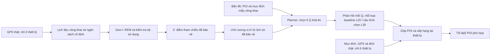

# Geo-I và planner khớp với dịch vụ POI công khai

Ngày rà soát: **06/10/2026**. Đây là ghi chú về thuật toán và thiết kế thí nghiệm
đã khóa nguồn. **Hai vòng đổi planner Q đều không qua gate. Tăng độ sâu phản
hồi dịch vụ lên L30 qua gate development và fresh synthetic TEST:** macro
gain **+2.974 pp**, CI95% **[2.308,3.646] pp**, thêm **31.102% reply JSON bytes**
trên TEST. Điểm fresh chỉ được mở sau independent validation PASS và hash
chain khớp. Giữ các vòng thất bại; không khẳng định đủ chuẩn nộp JISA.

## Ý tưởng và luồng xử lý

Geo-I vẫn bảo vệ các lần đọc GPS bằng REM và phép kiểm tra tái sử dụng điểm
tham chiếu đã có. Hai vòng đầu thử thay cách chọn vị trí truy vấn **Q** từ thông tin
đã được bảo vệ và dữ liệu công khai nhưng không qua gate. Cấu hình đã xác nhận
giữ nguyên Q và tăng phản hồi từ L20 lên L30. Giả thuyết planner ban đầu là chọn Q tốt hơn nếu nó
tính đúng những POI mà dịch vụ thực sự trả về và những loại tìm kiếm mà người
dùng có thể cần, thay vì chỉ tối ưu một bảng trả lời ngắn hơn hoặc tìm điểm gần
nhất.



Ở bước không được đọc GPS, cơ chế vẫn dự đoán và chọn Q từ lịch sử được phép
dùng. Nó không lấy thêm GPS để cải thiện planner. Phân bố ước lượng là một mô
hình xấp xỉ trên lưới trạng thái công khai; không được gọi nó là posterior thật
đã được hiệu chuẩn. [`_FilterBelief`](../../benchmark/engines/filtered_cover.py)
ghi rõ mô hình này không biểu diễn đầy đủ thông tin của lịch sử nhánh nội bộ.

## Các cấu hình của vòng đầu

| Cấu hình trong mã | Nội dung planner | Vai trò trong thí nghiệm |
|---|---|---|
| `legacy_l10` | Planner cũ, chữ ký phản hồi L10, trọng số gần nhất cũ | Đối chứng giữ thuật toán cũ |
| `aligned_nearest` | Cùng planner/trọng số gần nhất, chữ ký phản hồi L20 | Đo tác động của việc khớp chiều sâu phản hồi |
| `multi_mean` → `aligned_mean_multi` | L20 và trung bình các mục đích mẫu công khai | Đo phần thêm mục đích và quy tắc trọng số profile |
| `tail25`, `tail50` → `risk_multi` | Cùng khởi tạo đa mục đích, thêm trao đổi để cải thiện đuôi utility | Hai trọng số công khai λ=.25/.50; **cả hai dùng a=.25** |

**Mọi cấu hình được bảo vệ trong thí nghiệm đều gọi dịch vụ L20.** Tên
`legacy_l10` nói về chữ ký mà planner sử dụng, không nói dịch vụ chỉ trả L10.
Vì vậy, so sánh cấu hình được chọn với `legacy_l10` gồm cả tác động căn chỉnh
L20. So sánh phụ với `aligned_nearest` mới giúp nhận biết phần bổ sung vượt
ra ngoài căn chỉnh đó. Không được mô tả L20 như một cải thiện miễn phí trên
benchmark dịch vụ L10 trước đây.

Các nhãn trên là cấu hình của một pipeline Geo-I, không phải nhiều cơ chế
riêng tư mới. Factory nằm trong
[`public_service_planner.py`](../../benchmark/engines/public_service_planner.py).
Hai đối chứng đầu tạo nguyên lớp `PacedSlackProgressLaneDummy`; hai cấu hình
đa mục đích chỉ thay `postprocess` và metadata công khai.

## Profile công khai và hàm mục tiêu

Với mỗi trạng thái trên lưới ước lượng, builder tính tập POI tham chiếu top5
cho từng loại POI và từng mục đích:

- Khoảng cách đường có hướng ngắn nhất.
- Thời gian đi đường ngắn nhất với tốc độ công khai trên đồ thị.
- POI trong bán kính công khai cố định1.000m, rồi xếp theo khoảng cách.
- Độ vòng đường nhỏ nhất khi ghé POI trước một đích **mẫu công khai**.

Mỗi mục đích có trọng số1/4, mỗi loại POI có trọng số bằng nhau. Các đích mẫu
được lấy bằng quy tắc lưới9 điểm trên bounding box của bản đồ, chiếu lên lưới
trạng thái công khai và bỏ đích trùng; không dùng hai đích thật của gia đình
SUMO. Các đích còn lại chia đều trọng số của mục đích vòng đường. Tập tham
chiếu giống nhau được gộp và cộng khối lượng xác suất, giữ nguyên mục tiêu.

Gọi $R_j$ là một tập tham chiếu không rỗng và $U(Q)$ là hợp POI trả về từ
5 Q. Utility mẫu là

\[
v_j(Q)=\frac{|R_j\cap U(Q)|}{|R_j|},\quad
\mu(Q)=\sum_j w_jv_j(Q).
\]

Profile rỗng được lưu là **N/A**, kèm khối lượng chưa định nghĩa. Mục tiêu
chuẩn hóa lại khối lượng **chung** trên các profile không rỗng. Đây là một
quy tắc trọng số của cấu hình đa mục đích: nó khác việc chuẩn hóa từng trạng
thái trước rồi lấy trung bình. Không được quy toàn bộ chênh lệch chỉ cho
việc “thêm mục đích”. Builder và phép chuẩn hóa có thể kiểm tra trong
[`public_service_profiles.py`](../../benchmark/public_service_profiles.py).

Planner mean dùng weighted union, chọn tham lam rồi thực hiện số lần trao
đổi một Q có giới hạn. Q tiếp theo phải nằm trong vùng có thể đi tới trên
đường có hướng. Bước hướng tới mục tiêu có thể đổi trạng thái đường nhưng
giữ chữ ký phản hồi; slack utility cũ=.03 cho phép tiến tới mục tiêu với mức
giảm mục tiêu mean giới hạn ở bước đó.

Planner risk khởi tạo bằng hành động mean khả thi của **chính bước hiện tại**.
Nó tối ưu

\[
J(Q)=(1-\lambda)\mu(Q)+\lambda\operatorname{LCVaR}_{a}(v(Q)),
\qquad a=.25,
\]

trong đó LCVaR là trung bình25% khối lượng có recall thấp nhất, có chia phần
khối lượng ở ngưỡng. Mỗi lần duyệt chấm mọi đại diện chữ ký phản hồi khả thi
cho một track, rồi chỉ nhận trao đổi cải thiện J và thỏa

\[
\mu(Q)\geq\mu(Q_{\text{mean,current}})-.01.
\]

Tối đa3 trao đổi được nhận. Score của cả hành động được tính lại trước khi
nhận. Khi λ=0, cấu hình risk phát lại đúng hành động mean tương ứng.
“Risk” ở đây là **utility thấp ở các profile**, không phải xác suất attacker
thành công. Không có bảo đảm nghiệm tối ưu toàn cục, bảo đảm utility của
GPS thật, hay bảo đảm loss=.01 giữa hai chuyến chạy: Q trước đó có thể làm
thay đổi vùng khả thi ở các bước sau. Ba khái niệm khác nhau phải giữ tên:
đuôi profile trong planner, đuôi phân bố family khi đánh giá, và đoạn thời
gian400–600s ở cuối chuyến.

## Những biến đã giữ cố định

| Thành phần | Thiết kế khóa cho thí nghiệm planner |
|---|---|
| Geo-I | REM, noisy reuse, filter chi tiêu triển vọng và pacing hiện có |
| Ngân sách | Epoch8 session, effective tổng .23/m; u=.00125/m; H12; cap effective mỗi session=.02875/m, nominal=.03/m |
| GPS | Khoảng đọc tối thiểu60s; wrapper không gọi supplier ở bước skip/hết cap; cửa sổ0–600s chỉ có tối đa11 lần đọc |
| Truy vấn | 5 Q mỗi sự kiện công khai; mỗi Q lấy tối đa20 POI của **tất cả loại công khai** |
| Local answer | Top5, khoảng cách/thời gian/bán kính/vòng đường chính xác trên cùng đồ thị; GPS và đích thật chỉ ở evaluator/local ranker |
| Ước lượng | Emission/prior/lưới Geo-I giữ nguyên; lưới trạng thái200m, catalogue làn40m; θ200m |
| Ghép mẫu | Cùng khóa riêng theo family/draw và miền session; assert từng Z, nhánh ledger và clock đọc GPS giống nhau giữa cấu hình |
| Execution | Tối đa3 worker, mỗi worker1 native thread; cache shortest path có giới hạn và tính lại chính xác |

H không có nghĩa sau đúng12 lần đọc chắc chắn dừng: filter tính chi phí nhánh
và chỉ bắt đầu một bước nếu còn đủ chi phí xấu nhất cho bước đó. Nominal=.24/m
cho8 session khác effective=.23/m đã khóa. Tất cả cap, lịch và allocation
được quyết định từ chính sách công khai; không chọn H/budget từ độ dài riêng
của chuyến. Các assert này kiểm tra code và realization ghép mẫu, không thay
cho chứng minh triển khai float/PRNG thỏa pure Geo-I.

Planner không nhận private `QuerySpec`, category, radius hay destination.
Do đó đổi mục đích local trên cùng luồng Q không thêm traffic hay đổi Q.
Đổi **cấu hình planner công khai** có thể đổi Q, độ dài phản hồi và nguy cơ
suy luận. Cùng cap không đồng nghĩa attacker đạt cùng hiệu quả. Pipeline này
không ẩn account/IP, không chứng minh identity anonymity và không tự đánh
giá mọi scenario. Đây là phép thay planner; không được gộp thành kết luận
về toàn bộ cấu hình bảo vệ đầu/cuối trong các benchmark trước.

## Vòng đầu thất bại và sửa trọng số ở V2

Readout đầy đủ trên6 family SELECTION, mỗi family3 draw, cho kết quả sau.
Đơn vị chênh lệch là **percentage points (pp)**, không phải phần trăm tăng
tương đối:

| Cấu hình vòng đầu | Current macro Recall@5 | Chênh lệch với legacy | Gate đã khóa |
|---|---:|---:|---|
| `legacy_l10` | 92.189% | Đối chứng | — |
| `aligned_nearest` | 92.128% | −0.061pp | Không đủ gain |
| `multi_mean` | 91.778% | −0.411pp | Không đủ gain |
| `tail25` | 92.626% | +0.437pp | Không đủ gain; S5/S6 guard thất bại |
| `tail50` | 92.621% | +0.433pp | Không đủ gain; S5/S6 guard thất bại |

Gate development yêu cầu gain ít nhất **1pp** (`.01` trên rate0–1). Với hai
tail arms, attacker accuracy S5/S6 tăng **11.111pp**, vượt guard10pp. Do đó
`selected=null`; không chọn tail vì riêng mean tốt hơn, không nới ngưỡng và
không mở fresh để cứu kết luận. Các số và lý do được giữ trong
[`defense_selection.json`](../../artifacts/benchmarks/qplanner_development_20261006_v2/defense_selection.json),
với hash input readout đã khóa. Đây là evidence exploratory trên các nhóm
cũ, không phải bằng chứng hiệu quả trên holdout.

Một điểm lệch contract đáng sửa xuất hiện ở within-radius: chỉ10.008/27.216
category references được định nghĩa, nhưng4.506/4.536 windows có ít nhất một
category hợp lệ. Evaluator lấy trung bình các category hợp lệ **trong mỗi
window** rồi lấy trung bình từng purpose. Cách gộp reference của vòng đầu
có thể làm một trạng thái với nhiều category hợp lệ nhận trọng số lớn hơn,
và purpose radius mất trọng số vì nhiều category rỗng. Đây là giả thuyết về
thiết kế hàm mục tiêu; chưa chứng minh nó là nguyên nhân duy nhất của
chênh lệch benchmark.

V2 sửa thứ tự chuẩn hóa. Với latent công khai x, purpose p và prototype đích
công khai d, gọi C(x,p,d) là các category có reference không rỗng. Trong
**từng case** (x,p,d), tính trung bình recall trên C(x,p,d). Sau đó tích phân
theo belief đã bảo vệ b(x) và prior prototype công khai π(p,d), rồi chuẩn
hóa riêng từng purpose:

```text
D(p) = Σ[x,d] b(x) × π(p,d) × 1[C(x,p,d) không rỗng]
μ(p,Q) = Σ[x,d có C không rỗng] b(x) × π(p,d) × mean[c trong C] recall(x,p,d,c,Q) / D(p)
μ(Q) = mean[p có D(p)>0] μ(p,Q)
```

Purpose có D(p)=0 vẫn là N/A, không đặt score0/1. Mẫu đích detour có prior
đều **trước** điều kiện hóa valid case; sau điều kiện hóa, xác suất đích
không nhất thiết còn đều. Builder/planner không nhận GPS, mục đích hoặc
đích thật của người dùng.

Ví dụ unit test: belief chia đều giữa A có1 category hợp lệ và B có6 category
hợp lệ. Nếu hành động chỉ cover A, mean của purpose đó phải là.5. Gộp
category trước sẽ cho1/7. Test đồ thị có hướng và oracle `QuerySpec` độc lập
kiểm tra thứ tự này, các case/purpose rỗng, và trường hợp mọi case hợp lệ
mà mean/CVaR trùng quy tắc cũ.

| Cấu hình V2 | Motion utility slack | Trọng số tail λ | Tác động cần tách riêng |
|---|---:|---:|---|
| `legacy_l10` | .03 | — | Đối chứng cũ, cùng realization |
| `aligned_nearest` | .03 | — | Đối chứng khớp chữ ký L20 |
| `normalized_mean` | .03 | 0 | Chỉ thay profile normalization |
| `normalized_tight` | 0 | 0 | Normalization và tắt bước đổi hướng có slack |
| `normalized_tail` | 0 | .25 | Như tight, thêm tail exchange |

Mọi tail arm vẫn có a=.25, mean floor=.01 và tối đa3 exchange. LCVaR V2
tính trên **reference profiles với trọng số mới**, không phải chỉ4 purpose
means. Slack0 không tạo lookahead, không ràng buộc mọi risk exchange giữ
nguyên global goal và không bảo đảm motion tốt hơn. Hàm chuyển động vẫn là
thuật toán kế thừa đã có; khả năng Q bị kẹt trong vùng có thể đi tới sau khi
Z đổi vẫn là một giới hạn cần đo.

Mã bổ sung nằm trong
[`public_service_profiles_v2.py`](../../benchmark/public_service_profiles_v2.py) và
[`public_service_planner_v2.py`](../../benchmark/engines/public_service_planner_v2.py).
Factory kiểm tra tham số được truyền có đúng arm cố định, không âm thầm thay
cấu hình. Nó không sửa source vòng đầu, sampler, cap, clock hay GPS.

V2 chạy lại đủ30 family/draw blocks development, dùng đúng khóa riêng cũ
theo từng block. Metadata `paired_development` khóa dataset, job inventory,
ngân sách, K/L/θ, nguồn primitive/control và manifest của vòng đầu. Khóa chỉ
sao chép trong `/private/tmp`; không có SQLite hay key digest trong artifact.
Verifier phải đối chiếu output/Z, nhánh và chi tiêu ledger, clock đọc GPS,
utility và wire của hai control sau generation; các phép đo thời gian chạy
được loại khỏi đối chiếu bitwise. Tái dùng realization giúp so sánh intervention rõ
hơn; nó **không** biến development cũ thành independent holdout hoặc cho
phép công bố đồng thời hai deployment là một privacy cap.

Gate numeric giữ nguyên. Nếu V2 có arm đủ điều kiện, freeze nguồn/config
trước benchmark fresh; nếu không, giữ kết quả thất bại. **V2 đã hoàn tất với
lựa chọn NONE; fresh của depth L30 được báo riêng dưới đây.** V2 ở đây là phiên bản thuật toán:
artifact `qplanner_development_20261006_v2` chứa vòng đầu chạy parallel,
còn `qplanner_development_20261006_v3` chứa vòng normalization V2 đã hoàn tất.

V2 cũng không có candidate qua gate tăng ít nhất1 pp. Các số dưới đây là
current macro trên6 family SELECTION ×3 draw ghép đúng realization; CI95%
paired-family là exploratory và chưa chỉnh cho nhiều cấu hình:

| Cấu hình vòng2 | Gain so với legacy, pp | CI95% gain, pp | Gate |
|---|---:|---:|---|
| `aligned_nearest` | −.061 | [−2.094,1.970] | Không đủ gain |
| `normalized_mean` | +.118 | [−1.780,2.014] | Không đủ gain |
| `normalized_tight` | −.345 | [−3.305,2.626] | Không đủ gain |
| `normalized_tail` | −.344 | [−3.101,2.500] | Không đủ gain |

Vì vậy không freeze hoặc chấm fresh cho các planner này. Lựa chọn `null` và
các guard nằm trong
[`defense_selection.json`](../../artifacts/benchmarks/qplanner_development_20261006_v3/defense_selection.json);
delta/CI từ
[`paired_family_readout.json`](../../artifacts/benchmarks/qplanner_development_20261006_v3/paired_family_readout.json).
Gate dùng số gốc, không dùng số đã làm tròn trong bảng.

## Hướng đã qua development: tăng số POI trả về, giữ nguyên Q

Thí nghiệm tiếp theo giữ **đúng luồng Q của `legacy_l10`**, tức planner vẫn
dùng signature L10. Chỉ đổi cấu hình dịch vụ từ L20 sang L30/L40/L60 **mỗi
loại POI, mỗi Q**. Dịch vụ trả cùng thứ tự khoảng cách đường có hướng và
lexical POI-ID tie break; mọi mức là prefix của một bảng công khai L60. L20
phải tái tạo đúng từng utility row, POI ID và số byte cũ. Không chạy lại
protected GPS supplier, sampler Geo-I, anchor Z, ledger hay Q. Lịch đọc60s
thuộc supplier/ledger bảo vệ; UtilityEvaluator vẫn dùng GPS ground truth
synthetic tại **mỗi public event** và đích thật để xếp hạng local chính xác.
Score là local oracle utility, chưa kiểm chứng ranking chỉ từ fix60s hoặc
tiêu thụ năng lượng GPS vật lý.

Với catalogue và cách xếp hạng local cố định, POI pool ở mức L lớn hơn chứa
pool cũ. Vì vậy reference Recall và completion không giảm theo từng sự kiện.
Đây là tính chất của **retrieval tĩnh**, không phải cải thiện privacy. Số Q,
tọa độ và lịch gửi không đổi; trường L công khai và số POI/byte trả về tăng.

Tiêu chí đã ghi **trước khi tính score theo độ sâu**: chọn mức nhỏ nhất trong
30/40/60 có current equal-family/equal-purpose Recall tăng ít nhất2 pp,
nearest không giảm, và tổng reply compact-JSON bytes không quá2.5 lần L20.
Giữ cả4 mức; nếu không mức nào đạt thì trả `NONE`.

| Độ sâu dịch vụ | Recall macro SELECTION | Tăng so với L20 | Reply JSON so với L20 |
|---|---:|---:|---:|
| L20 | 92.188% | — | 1.000× |
| **L30** | **94.762%** | **+2.573 pp** | **1.311×; thêm31.094%** |
| L40 | 96.459% | +4.270 pp | 1.622× |
| L60 | 97.799% | +5.610 pp | 2.243× |

L30 là mức nhỏ nhất qua gate. Development có6 family độc lập, mỗi family3
draw và8 session; không coi draw/tick là subject độc lập. CI95% paired-family
bootstrap10.000 lần của gain L30 là **[1.793,3.509] pp**; CI này vẫn là
exploratory, chưa phải xác nhận fresh. Nguồn:
[`readout`](../../artifacts/benchmarks/qplanner_response_depth_development_20261006_v1/readout.json),
[`paired readout`](../../artifacts/benchmarks/qplanner_response_depth_development_20261006_v1/paired_readout.json),
[`selection`](../../artifacts/benchmarks/qplanner_response_depth_development_20261006_v1/depth_selection.json),
[`independent validation`](../../artifacts/benchmarks/qplanner_response_depth_development_20261006_v1/validation.json).

Chi phí trên toàn SELECTION tăng từ **123,907,067** lên **162,434,661 bytes**
reply; vẫn22680 yêu cầu và3425526 bytes request theo serialization đã khóa.
Đây là application payload JSON ước tính từ các reply thật của simulator,
chưa đo HTTP/TLS, latency, pin hay chi phí nhà cung cấp. Bulk retrieval tĩnh
vẫn là khoảng cách quan trọng với dịch vụ LBS thực tế. Cấu hình này **trả thêm
bandwidth để lấy thêm utility**, không phải thuật toán Q mới hoặc bằng chứng
vượt phương pháp khác khi họ cũng được dùng L30/cùng cost.

Fresh chỉ dùng L30 đã chọn và L20 trên cùng một luồng legacy Q. Protocol
phải freeze trước generation/scoring; primary đã định là current macro
Recall gain≥2 pp, CI95% family-bootstrap có cận dưới>0 và cả3 draw có gain>0.
Fresh đã hoàn tất và được verifier độc lập kiểm tra trước khi mở số:

| Fresh TEST, current responses | L20 Recall | Geo-I / REM, L=30 Recall | Gain, pp | CI95% gain, pp |
|---|---:|---:|---:|---:|
| **Equal-purpose macro, primary** |**89.714%**|**92.688%**|**+2.974**|**[2.308,3.646]**|
| Nearest |92.449%|94.680%|+2.230|[1.741,2.732]|
| Fastest |92.449%|94.678%|+2.229|[1.741,2.731]|
| Within radius |81.694%|86.879%|+5.185|[3.992,6.396]|
| Minimum detour |92.266%|94.516%|+2.250|[1.733,2.798]|

TEST gồm **24 family độc lập, mỗi family3 draw và8 session**. Cả3 primary gate
đều PASS; các draw có gain **2.867/2.929/3.126 pp**. CI lấy10.000 whole-family
bootstrap với public seed2026100617, giữ session/draw bên trong family.
Within-radius có **42,258/108,684** category references defined (38.9%) và
**17,577/18,114** windows defined; empty reference giữ N/A. Các purpose khác
đều đủ references. Purpose và các sensitivity là kết quả phụ exploratory.

| Fresh sensitivity | L20 macro | L30 macro | Gain, pp | CI95% gain, pp |
|---|---:|---:|---:|---:|
|25% family thấp nhất: LCVaR |83.565%|88.046%|+4.481|[3.751,5.415]|
|Cold: toàn session0 |88.333%|91.454%|+3.122|[2.295,3.971]|
|Temporal tail400–600s |92.388%|94.880%|+2.492|[1.911,3.063]|
|Static epoch cache, all |98.808%|99.136%|+.328|[.220,.452]|

LCVaR contrast là hiệu hai mean của25% family thấp nhất, không phải tail của
từng delta. **Current-only vẫn là primary; cache là sensitivity thứ hai** và
không chứng minh freshness trong dịch vụ động. TEST trả **494,713,236→648,578,577
reply bytes**, ratio **1.311019×**, tức thêm **31.102%**; vẫn **90,570 requests**
và **13,678,985 request bytes**. Đây là chi phí TEST đã lưu, không suy từ
31.094% của development.

Nhãn dễ đọc là **Geo-I / REM, L=30**. L là maximum POIs **mỗi category mỗi Q**,
không phải ID configuration30/67; vẫnK=5 Q và local top-k=5. Xem
[`fresh README`](../../artifacts/benchmarks/qplanner_response_depth_generalization_20261006_v1/README.md),
[`recommended configuration`](../../artifacts/benchmarks/qplanner_response_depth_generalization_20261006_v1/recommended_configuration.json),
[`independent certificate`](../../artifacts/benchmarks/qplanner_response_depth_generalization_20261006_v1/validation.json)
và [scientific figure](../../artifacts/benchmarks/qplanner_response_depth_generalization_20261006_v1/figures_v2/response_depth_utility_cost.pdf).
Đây là xác nhận utility/cost trên synthetic cohort mới **cùng map**, không phải
thuật toán Q mới, privacy theorem hoặc đánh bại baseline được cùng L/cost.

Trình tự các vòng được giữ rõ:

| Vòng | Intervention development | Lựa chọn | Fresh |
|---|---|---|---|
|1|Căn reply signature và thêm joint-profile/risk objective cho Q|NONE|Không chạy|
|2|Chuẩn hóa theo từng case, từng purpose; thử slack chặt hơn|NONE|Không chạy|
|3|Giữ đúng legacy Q; replay public service depth20/30/40/60 theo rule mới ghi trước scoring|L30 nhỏ nhất qua gate|Pre-score freeze; primary PASS trên24 family mới, trả thêm31.102% reply bytes|

Đây là các vòng development có học từ kết quả trước. Việc hai vòng Q không
đạt được lưu đầy đủ; vòng3 là utility/cost tuning có intervention khác, không
phải sửa score, chọn lại sample hay viết lại kết quả của hai vòng đầu.

## Trình tự evidence và giới hạn diễn giải

Development dùng18 nhóm native cũ:12 TRAIN và6 SELECTION. Các nhóm này đã
được khảo sát trước đó, nên không phải holdout độc lập. TRAIN có1 draw,
SELECTION có3 draw; mỗi block giữ đủ8 session. Quy tắc chọn defense được viết
sau smoke một family SELECTION và trước readout tổng, vì vậy phải gọi đó là
**exploratory selection**. Không được gọi development gate là đăng ký trước
khi xem bất kỳ dữ liệu nào. Quy tắc không được nới khi candidate thất bại.

Gate đã khóa trong
[`qplanner_select_and_freeze_20261006.py`](../../experiments/qplanner_select_and_freeze_20261006.py):
current equal-purpose/equal-family recall tăng ít nhất.01; nearest giảm không
quá.005; guard hữu hạn cho S9/S10 và S5/S6. S9/S10 dùng method-adapted bank
gồm observed-slot/Hungarian/aggregate/sequence và geometric/history decoders.
S5/S6 dùng hai lựa chọn tương lai công khai, lịch sử6 session và query prefix
nhân quả. Bank học trên TRAIN, decoder chọn trên SELECTION theo tiêu chí đã
khóa. Guard privacy là heuristic, không phải equivalence/noninferiority test.

Vòng normalization dùng selector bổ sung
[`qplanner_select_and_freeze_20261006_v2.py`](../../experiments/qplanner_select_and_freeze_20261006_v2.py),
giữ nguyên các ngưỡng numeric. Vòng này được thiết kế sau khi thấy đầy đủ
development vòng đầu, nên lựa chọn V2 vẫn là exploratory; không viết lại
lịch sử đó thành lần đánh giá đầu tiên của một defense chưa từng được tune.

Nếu không có candidate qua gate, giữ kết quả đó và không tạo “winner”. Nếu
có, lưu lựa chọn, hash nguồn/config và `freeze.json` **trước benchmark fresh**.
Fresh dùng nhóm junction mới trong cùng SUMO map/generator; TRAIN1 draw,
SELECTION1 draw để chọn attacker, TEST3 draw. Tuyên bố gần nhất có thể kiểm
tra là generalization trên nhóm synthetic cùng bản đồ, chưa phải real GPS,
khác thành phố hay dịch vụ động.

Phần tiếp theo mô tả protocol fresh **đã dự kiến cho planner nếu qua gate**;
hai vòng planner đều fail nên protocol này chưa được chạy. Depth ablation
ở trên có primary L30−L20 riêng và không cần alignment secondary vì cùng Q.

Primary fresh của protocol planner là candidate−`legacy_l10`, **current/all/equal-purpose/equal-family
Recall@5**. Điều kiện khóa: mean gain≥.02, cận dưới95% paired-family bootstrap>0,
và mean gain>0 trong từng draw TEST. Candidate−`aligned_nearest` là đối chứng
phụ về phần vượt căn chỉnh. Bootstrap10.000 lần lấy toàn bộ family cluster,
giữ mọi session/draw bên trong; không coi ticks hoặc3 draw là3 subject độc lập.
LCVaR giữa hai phương pháp là **hiệu hai LCVaR**, không phải LCVaR của từng
hiệu. Coverage/N/A và complete-four-purpose sensitivity luôn giữ lại. Nhiều
purpose/control/phase development có CI exploratory chưa chỉnh multiplicity;
chỉ một contrast fresh được đánh dấu primary.

Nearest và fastest có thể rất tương quan trên đồ thị tốc độ tĩnh. Trung bình
bốn mục đích là workload aggregate đã chọn, không phải bốn kiểm chứng độc lập.
Detour khi đánh giá dùng đích thật ở local evaluator, khác prior đích mẫu của
planner. Recall top5 không đại diện rating, giờ mở cửa, nhu cầu thời gian thực,
truy vấn văn bản hay mọi query purpose.

**Static bulk gate:** mỗi sự kiện của một cấu hình bảo vệ phát5 yêu cầu, mỗi
yêu cầu lấy tối đa20 POI **mỗi loại** ở hai vòng planner; depth ablation trả
20/30/40/60 POI mỗi loại, L30 là mức được chọn ở development. Đây là giả định
retrieval khá rộng; cải thiện utility chỉ có ý nghĩa khi reader chấp nhận
cost/khả năng phục vụ đó. Raw chỉ phát1 yêu cầu, là positive/context control,
không phải đối chứng cùng cost. Số request và compact-JSON bytes được lưu;
không gọi đó là HTTP/TLS bytes, latency, battery hay khả năng triển khai đã
đo. Static epoch cache được báo riêng với primary current-only, không chứng
minh freshness/version validity khi dịch vụ thay đổi. Thời gian serial được
import và thời gian parallel mới không tạo thành benchmark latency công bằng.

## Trạng thái hiện tại và cách tái lập

| Bằng chứng | Trạng thái trong ghi chú này |
|---|---|
| Source/config planner, ngân sách và contract dịch vụ | Đã khóa; các source snapshot giữ trong protocol artifacts |
| Unit/integration tests | Đã kiểm tra vectorized CVaR với oracle và nhánh Geo-I/GPS/ledger ghép mẫu |
| Development vòng đầu | Đã đủ; gate NONE, không có candidate được chọn |
| Development normalization V2 | Đã đủ; gate NONE, không chấm fresh cho các planner này |
| Development response depth L20/30/40/60 | Full independent validation PASS; L30 nhỏ nhất qua gate với thêm31.094% reply JSON |
| Fresh L30−L20 trên cùng legacy Q | Independent PASS;24 family ×3 draw; primary+2.974 pp, reply bytes+31.102% |
| Real mobility, khác bản đồ, dịch vụ động, deployment | Chưa có trong thí nghiệm này |

Serial v1 và partial của nó được giữ nguyên. Execution v2 sao chép byte-identical
prefix đã hoàn thành, giữ hash/transfer receipt; khóa của block đang dở chỉ
được giữ trong `/private/tmp`, không sao chép SQLite. Completion có thể khác
thứ tự submit nhưng manifest cuối theo thứ tự family/draw đã định. Không thay
draw vì chạy chậm hay số xấu. Wrapper, môi trường và cache công khai có hash
execution riêng.

Các lệnh dưới đây là **lệnh tái lập vào output mới**; output đã có
`generation_started.json` không chạy lại. Giữ nguyên nguồn đã khóa, dùng
Python env đã cài requirements, và thay `NEW` bằng tên chưa tồn tại:

```bash
python -m experiments.qplanner_parallel_generation_20261006 \
  --dataset artifacts/datasets/future_controlled_20261005_v2/dataset.json.gz \
  --output artifacts/benchmarks/qplanner_development_NEW \
  --workdir /private/tmp/qplanner_development_NEW \
  --public-cache /private/tmp/trajectory-native-future-evaluation-v1/qplanner-development/public_resources \
  --train-draws 1 --selection-draws 3 --processes 3
```

Không truyền import sẽ tạo khóa OS mới: đó là lần chạy mới của cùng thiết
kế, không phải phát lại chính realization cũ. Muốn giữ block cũ, thêm
`--import-output` và `--import-private-root` trỏ đến evidence/khóa gốc đã giữ;
wrapper chỉ nhận prefix đầy đủ và protocol giống nhau. Khóa/ledger không được
đưa vào repository hoặc API attacker.

Để tái lập vòng normalization V2 theo chính các private realization cũ, dùng
module V2 và output/workdir **mới**, không chạy lại artifact v3 đang có:

```bash
python -m experiments.qplanner_parallel_generation_20261006_v2 \
  --output artifacts/benchmarks/qplanner_normalized_development_NEW \
  --workdir /private/tmp/qplanner_normalized_development_NEW \
  --public-cache /private/tmp/trajectory-native-future-evaluation-v1/qplanner-development/public_resources \
  --paired-development-output artifacts/benchmarks/qplanner_development_20261006_v2 \
  --paired-private-root /private/tmp/qplanner-parallel-development-20261006-v2/private_state \
  --train-draws 1 --selection-draws 3 --processes 3
```

Hai argument `paired-*` chỉ dùng cho cùng cohort development đã đủ, không
cho cohort fresh. V2 kiểm tra hash/job/contract trước khi chạy. Phần normalized
được chạy lại, không sao chép score/output của nó từ vòng đầu. `utility_readout`,
`attack_readout` và verifier của **module V2** phải dùng đúng artifact V2.

Khi generation đã đủ, gọi `utility_readout` và `attack_readout` từ module
study với đúng output/workdir, rồi verifier độc lập. Không chạy trước khi có
manifest đầy đủ. Để đọc interval development:

```bash
python -m experiments.qplanner_paired_readout_20261006 \
  --output artifacts/benchmarks/qplanner_development_NEW \
  --scope development --expected-draws 3
```

Chạy selector một lần sau development; fresh generation chỉ dùng output
common protocol/freeze đã tạo bởi selector. Wrapper tự suy ra study arguments
từ protocol đó và không đổi freeze. Khi paired readout fresh đã có và được
verifier kiểm tra, vẽ vào thư mục mới:

```bash
python -m experiments.plot_qplanner_paired_20261006 \
  --input artifacts/benchmarks/qplanner_generalization_NEW/paired_family_readout.json \
  --output-dir /private/tmp/qplanner_generalization_NEW_figures
```

Script figure chỉ đọc readout đã có, không chạy mô hình, không chọn winner và
không tính lại CI từ raw data. Nó vẽ **ΔRecall tính theo percentage points**,
vì readout hiện tại không chứa absolute per-family Recall của mỗi phương pháp.
Mọi điểm/CI/coverage phải lấy từ file đầu vào; không vẽ placeholder bằng số
minh họa trong hình research. Figure lưu PDF/PNG cùng hash nguồn và input.

Với **response depth** đã đủ và được verifier kiểm tra, dùng consumer riêng:

```bash
python -m experiments.plot_qplanner_response_depth_20261006 \
  --development artifacts/benchmarks/qplanner_response_depth_development_20261006_v1 \
  --output-dir /private/tmp/response_depth_figures_NEW
```

Fresh replay/paired readout đã hoàn tất, freeze/hash và independent certificate
đã kiểm tra. Để export đủ các nhãn forest dài, wrapper thêm tight bounding
box và giữ nguyên builder/statistics/source cũ:

```bash
python -m experiments.export_qplanner_response_depth_20261006 \
  --development artifacts/benchmarks/qplanner_response_depth_development_20261006_v1 \
  --fresh artifacts/benchmarks/qplanner_response_depth_generalization_20261006_v1 \
  --output-dir /private/tmp/response_depth_fresh_figures_NEW
```

Figure đầu tiên và source snapshots được giữ; bản export có provenance riêng.
Development-only figure cũ vẫn ghi pending đúng tại thời điểm nó được tạo,
không được sửa để giả lịch sử xác nhận fresh.
