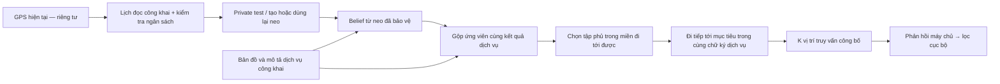

# Định vị contribution của vòng cải tiến

Trạng thái 24/09/2026: ứng viên nghiên cứu, chưa xác nhận vượt sáu paper hoặc
bảo vệ đủ năm scenario. Số đo mới nằm trong
[checkpoint](algorithm_loop_status.md); điều kiện chấp nhận được ghi trước ở
[protocol](algorithm_improvement_loop.md).

Đối chiếu mới ở [vòng 26](planar_anchor_ablation.md) cho thấy đổi REM sang
planar Laplace chuẩn tăng Recall trung bình, nhưng vẫn thiếu ca S1.C và làm
probe đầu phiên dễ bị suy luận hơn. Không gán lợi ích từ primitive chuẩn cho
planner, cũng không suy privacy thực nghiệm từ việc hai bản có cùng cận epsilon.
Phép chặn objective ở [vòng 25](capped_service_argument.md) kế thừa nguyên lý
saturation; contribution ứng viên phải nằm ở tích hợp/ràng buộc và kết quả,
không phải nhận công thức chặn là mới.

Cập nhật vòng 28: [dịch vụ POI khả dụng](live_service_results.md) cho Recall
95,60% ở cấu hình K5/slack/cache, cao hơn fixed K5 82,07%. Đây là lợi thế utility
trong API theo điểm; cache tăng 0,24 điểm phần trăm với cùng transcript. Không
suy ra ưu thế privacy, thắng cả sáu paper, hoặc thắng API tải toàn bộ bitmap.
Cấu hình này là lựa chọn làm việc theo ưu tiên dịch vụ, không phải người thắng
mọi mục tiêu.

## Luận điểm nên theo đuổi

**Tạo một tập truy vấn có thể di chuyển hợp lệ trên mạng đường, tối ưu kết quả
dịch vụ từ lịch sử đã được bảo vệ, trong ngân sách công bố hữu hạn.**

Luận điểm này chỉ có giá trị ứng dụng khi dịch vụ cần thông tin mà thiết bị chưa
có. Benchmark POI tĩnh hiện cho phép local cache trả đúng hoàn toàn; vì vậy chưa
thể lấy nó làm bằng chứng rằng giao tiếp bằng dummy là cần thiết.

Hết ngân sách: bộ chọn tiếp tục từ trạng thái được bảo vệ, không đọc GPS mới để
ra quyết định công bố. GPS dùng chấm điểm trong evaluator không được truyền ngược
vào bộ chọn. Thời gian mở/đóng phiên và lịch truy vấn chưa được bảo vệ bởi lập luận
tọa độ với đồng hồ cố định.

## Phần kế thừa và phần cần chứng minh

| Thành phần | Tình trạng contribution | Bằng chứng cần dùng |
|---|---|---|
| Geo-I, private test, tái sử dụng neo | Kế thừa; predictive test và quản lý ngân sách đã được nghiên cứu | Dẫn [PETS 2014](https://arxiv.org/abs/1311.4008); chứng minh tích hợp, không nhận phát minh primitive |
| Tối ưu utility dưới ràng buộc privacy | Kế thừa hướng bài toán | Đối chiếu [CCS 2014](https://arxiv.org/abs/1402.5029); chỉ rõ objective và output của ta |
| Gộp trạng thái có cùng chữ ký POI, giữ đúng đại diện theo tie rule | Cải tiến tính toán cụ thể của implementation; chưa xác nhận ưu tiên phát minh | Lập luận bảo toàn lựa chọn/transcript; test ghép cặp; runtime/preprocessing/memory |
| Chọn vị trí đi tiếp trong cùng chữ ký dịch vụ | Thiết kế mới trong repo, contribution ứng viên | Bảo toàn POI union tại bước hiện tại; khả thi theo đường; ablation dài hạn; đo cả lộ vị trí |
| Filter + planner | Contribution tích hợp ứng viên | Cùng cận chặt .23, cùng K và L; không gán lợi ích của tăng L cho thuật toán |
| Giãn lần đọc GPS theo đồng hồ công khai | Ablation phân bổ ngân sách của hệ thống; không phải primitive privacy mới | Vòng 13 đạt ngưỡng utility ở 14/15 ca thay vì 8/15, nhưng S1.C và S9 đầu phiên chưa giải quyết |
| Epsilon nhỏ hơn ở đầu phiên | Phân bổ ngân sách theo rủi ro, contribution ứng viên cần đánh đổi thực nghiệm | Vòng 12 có attacker đầu phiên khó hơn nhưng Recall không đạt; chưa chọn cấu hình |
| Tách top-k tham chiếu và top-L phản hồi trong objective | Sửa đúng hợp đồng dịch vụ, không phải phát minh maximum coverage | Vòng 15: unpaced tăng 8/15 → 14/15 ngưỡng utility ở cùng K5/L10; đã học lại attacker ở vòng 16. Trên 12 nhóm bổ sung, chưa có gain lớn ổn định so với pacing objective cũ |
| Cho phép giảm .03 objective để di chuyển sớm hơn | Ablation planner có đánh đổi, chưa phải người thắng | Trên 12 nhóm: S1.C 76,25% → 78,75%, nhưng khoảng bootstrap của gain chứa 0; S3.A utility tăng và MAE attacker giảm, tức privacy xấu hơn |
| Giãn đọc theo ngân sách còn lại | Ablation vòng 19, chưa được chọn; không nhận phát minh quản lý ngân sách | Tuổi lần đọc tại S1.C giảm 200 → 98 giây; kết hợp slack đạt 80,83% Recall, vẫn thiếu ngưỡng và gain chưa ổn định. Phải học lại attacker nếu tiếp tục ứng viên |
| Cắt/buffer đầu/cuối | Công cụ thí nghiệm hiện chưa đạt utility | Tính đủ truy vấn bị mất, thời gian trễ và endpoint attacks; không nhận là giải pháp S9/S10 đã hoàn thành |

Gộp theo kết quả dịch vụ cũng phải đối chiếu với remapping/discretization trước
đây. [Privacy-Aware Remapping (2024)](https://www.privateer-project.eu/wp-content/uploads/2024/02/SAC24-A_Privacy_Aware_Remapping_Mechanism_for_Location_Data.pdf)
gộp ô theo tần suất để điều chỉnh privacy/quality. Ở đây gộp **ứng viên đầu ra trong
miền khả thi của từng track** sau neo riêng tư. Đó là khác biệt cần khảo sát, chưa
phải kết luận rằng chưa ai có ý tưởng tương tự.

## Sáu đối chứng: khác nhau ở đâu, phải so thế nào?

Cột cuối là thiết kế phép so sánh của nghiên cứu này, không phải kết luận paper
yếu hơn. Các adapter đang có được kiểm kê trong
[benchmark/README.md](../../benchmark/README.md).

| Đối chứng | Cơ chế đã có | Khác biệt cần kiểm chứng của ứng viên | Phép so sánh hợp lệ |
|---|---|---|---|
| [DLS, INFOCOM 2014](https://pure.psu.edu/en/publications/achieving-k-anonymity-in-privacy-aware-location-based-services/) | Chọn dummy bằng entropy và thông tin nền; enhanced-DLS tăng độ trải không gian | Tập truy vấn của ta không cố ý chứa tọa độ thật và tối ưu kết quả dịch vụ qua chuỗi | Cùng số tọa độ/byte phản hồi; attacker suy ra tọa độ, không chỉ chọn phần tử thật. Không đồng nhất k-anonymity với epsilon |
| [RDG, bản tác giả](https://arxiv.org/abs/1805.06104) | Xét chuyển tiếp, transition entropy và Viterbi để xây dựng dummy bền hơn qua thời gian | Miền khả thi trên làn và objective hợp các kết quả dịch vụ | Đối thủ biết lịch sử; chấm S2/S3 trên cả chuỗi. Bản arXiv 2018 là tiền thân, không đổi năm số tạp chí 2021 thành 2018 |
| [TransProtect, 2024](https://arxiv.org/html/2409.09495v1) | Node2Vec/GCN/Transformer chấm ứng viên, kết hợp mất mát chi phí hành trình và geo-obfuscation | Bộ chọn của ta dùng belief từ neo đã bảo vệ và K truy vấn phủ dịch vụ | Phân biệt một vị trí thay thế với K truy vấn; đo cùng dịch vụ/chi phí hoặc đường Pareto. Markov proxy hiện có không phải mạng học sâu của paper |
| [Semantic correlation, 2026](https://link.springer.com/article/10.1007/s44443-026-00899-w) | Học tương quan không gian, thời gian, ngữ nghĩa; chọn dummy phù hợp đường di chuyển | Tách thông tin riêng tư tại neo; các bước chọn về sau chỉ dùng thông tin đã bảo vệ | Dùng suy luận tọa độ và dịch vụ thực; DER/khó nhận ra dummy không tương đương Recall POI. Nhãn OSM/empirical predictor trong adapter phải được công bố |
| [Fake-query insertion, 2026](https://link.springer.com/article/10.1007/s44443-025-00438-z) | Chèn truy vấn toàn giả giữa truy vấn lân cận để phá tương quan | Ứng viên giữ một tập truy vấn công bố theo đồng hồ cố định, quản lý ngân sách đọc GPS | Tính mọi bản tin chèn và latency; không cung cấp nhãn bản tin thật/giả cho attacker. Không ép mất lịch chèn để có cùng số event |
| [AnotherMe — mã tác giả](https://github.com/fang-zhiyou/AnotherMe) | Hệ thống quỹ đạo ảo online; có VTGA và ứng dụng di động công khai | Ngân sách tọa độ có lập luận và objective dịch vụ theo từng bước | Adapter VTGA trong repo hiện xử lý cả đoạn và căn chỉnh thời gian: phải ghi rõ phụ thuộc tương lai, không gọi đó là đối chứng online tương đương |

**Chưa có bảng thực nghiệm mới so đầy đủ sáu phương pháp.** So sánh thuật toán với
các ablation trong repo chứng minh được tác dụng thành phần, chưa chứng minh thắng
sáu công trình. K khác nhau hoặc epsilon khác đơn vị không tạo ra phép so công bằng.

Kết quả mở rộng và khoảng ghép cặp nằm ở
[bảng 12 nhóm](expanded_development_results.md). Đã có 1.020 lượt thực thi mới và
attacker phù hợp từng cơ chế; tất cả bốn ứng viên vẫn thiếu S1.C. Riêng S10.B có
[giới hạn suy luận từ prefix](s10_prefix_identifiability.md) ngay với raw; không
dùng điểm attacker thấp ở đó làm chứng cứ riêng cho contribution của defender.

## Ba nguồn gần với lập luận contribution cần đối chiếu thêm

Bổ sung sau vòng 20: dòng MPC location-privacy của Molina et al. (2023–2025)
cũng là tiền lệ trực tiếp. Xem [đối chiếu predictor, I/O và metric](predictive_planning_prior_art.md).
Không nhận look-ahead hoặc dự báo vị trí là nguyên lý privacy mới.

- **Atmaca et al., OJVT 2024:** đã kết hợp AGeoI và dummy cho truy vấn trạm sạc,
  dùng thông tin occupancy cập nhật. Mục VI phân tích chi phí tăng thêm theo
  khoảng cách đường và vùng Voronoi giữ nguyên trạm gần nhất. Do đó cả “Geo-I +
  dummy” lẫn ý tưởng các vị trí có cùng kết quả dịch vụ đều đã có tiền lệ.
  Khác biệt ứng viên của ta là tập K track có miền đi tới được, hợp top-L để
  phục hồi top-k nhiều category, và gộp ứng viên giữ nguyên bộ chọn. Phải chứng
  minh lợi ích cụ thể của các phần này. [Bản xuất bản, mục V–VII](https://wrap.warwick.ac.uk/id/eprint/183198/1/WRAP-privacy-preserving-querying-mechanism-high-utility-electric-vehicles-2024.pdf).
- **Chatzikokolakis et al., PoPETs 2017:** Bayesian remapping tối ưu expected
  loss là tiền lệ trực tiếp của phục hồi utility sau obfuscation. Belief dùng
  lịch sử và tập nhiều truy vấn có ràng buộc chuyển động là phạm vi cần so,
  chưa đủ để tự nhận một nguyên lý privacy mới.
  [Bài gốc, mục 3–4](https://petsymposium.org/popets/2017/popets-2017-0051.pdf).
- **LR-Geo, PoPETs 2025:** tối ưu LP ở các vị trí liên quan cục bộ, gửi hệ số để
  máy chủ giải và dùng Benders decomposition. Đây là nguồn đối chiếu hiệu quả
  tính toán; giao diện và giả định tin cậy khác bộ chọn cục bộ của ta nên không
  thể chuyển trực tiếp số runtime hay privacy của paper sang benchmark này.
  [Trang nhà xuất bản](https://petsymposium.org/popets/2025/popets-2025-0046.php).

Đã kiểm tra lại các nguồn chính ngày 24/09; PDF OJVT hiện truy cập được, thay cho
giới hạn chỉ đọc abstract ở lần rà soát cũ. Chưa tái lập ba phương pháp này.

## Bảo đảm hình thức nói được đến đâu?

Với đồng hồ cố định, cận đang dùng là B = 0,23 m⁻¹ cho khoảng cách D∞ giữa hai
chuỗi GPS. Nó giới hạn tỷ số xác suất bởi exp(B·D∞), theo các giả định của
[lập luận bộ lọc](predictive_filter_argument.md). Không nên chỉ ghi “có Geo-I”:

| D∞ | Cận tỷ số xác suất |
|---|---:|
| 1 m | exp(0,23) ≈ 1,26 |
| 10 m | exp(2,3) ≈ 9,97 |
| 50 m | exp(11,5) ≈ 98.716 |

Đây là cận bảo thủ, không phải xác suất attacker đoán đúng. Nó cũng cho thấy cận
toàn phiên hiện **không chặt ở thang 50–200 m**; không thể dùng riêng định lý để
khẳng định che giấu tốt endpoint. Hai phiên có thể liên kết hợp thành tối đa 0,46
m⁻¹ ở cấu hình đã so bằng cận chặt. Các vòng dùng trần 0,24 có cận cặp 0,48.

## Mệnh đề cuối cùng chỉ nên viết sau confirmation

“Trên workload W và ngân sách B được khóa trước, bộ chọn theo chữ ký dịch vụ
giảm chi phí tính toán mà giữ nguyên phân phối công bố; cơ chế tiến tới mục tiêu
cải thiện utility so với đối chứng X, với mức thay đổi privacy và chi phí Y.
Hiệu quả S1/S2/S3/S9/S10 được đánh giá riêng dưới các đối thủ và cửa sổ công bố
đã chỉ định.”

Hiện chưa điền được W, X, Y bằng kết quả xác nhận cuối cùng. Chốt workload máy chủ,
giữ local-cache control, tăng đối thủ và khóa một tập confirmation mới là điều
kiện trước khi dùng mệnh đề này trong kết luận luận văn.

## Bổ sung bằng chứng từ vòng 20–22

Học chuyển động từ auxiliary và lập kế hoạch hai thời điểm đã được hiện thực,
nhưng chưa giúp qua S1.C; không đưa chúng vào danh sách contributions đã chứng
minh. [Pilot và phạm vi](lookahead_service_planning.md). Thêm thành phần dự báo
không tự tạo novelty; predictive location-privacy control đã có từ trước.

Đối chứng mới [fixed public query cover](public_cover_control.md) làm rõ claim
có thể theo đuổi: **cải thiện utility ở số truy vấn giới hạn**, với privacy và
chi phí được công khai. Trên 12 nhóm phát triển, cùng K5/L10, paced+slack đạt
utility cao hơn control công khai ở 14 ca, nhưng kém ở S1.C. Control K12 đạt cả
15 ngưỡng và không đọc GPS; không thể gọi phương pháp thích nghi là privacy–
utility dominant. Đây chưa phải đối chứng paper nguyên bản, xác nhận độc lập,
hoặc bằng chứng rằng bài toán POI tĩnh cần giao tiếp từ xa.

Vòng 23 thử cố định hai truy vấn để dành coverage công khai: S1.C core đạt 90%
nhưng các ca khác giảm, chưa có ưu thế chung. Vòng 24 bổ sung đối thủ cùng site
và phát hiện S9.C Hit100=12,5% cho một estimator được chọn bằng auxiliary trong
product bank. Vì vậy, không dùng Hit100=0 của một bộ chọn cũ làm contribution
“không suy ra origin”. [Bằng chứng](repeated_site_density_attack.md).

Đã đối chiếu thêm [DRL local search 2026](recent_drl_local_search_note.md) để
phân biệt mục tiêu dịch vụ snapshot với cơ chế quỹ đạo có ngân sách. Đây là
related work bổ sung, chưa phải một comparator được tái lập.
